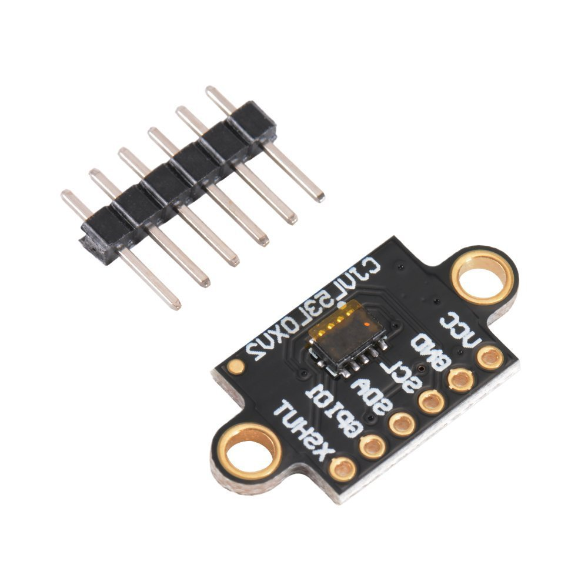
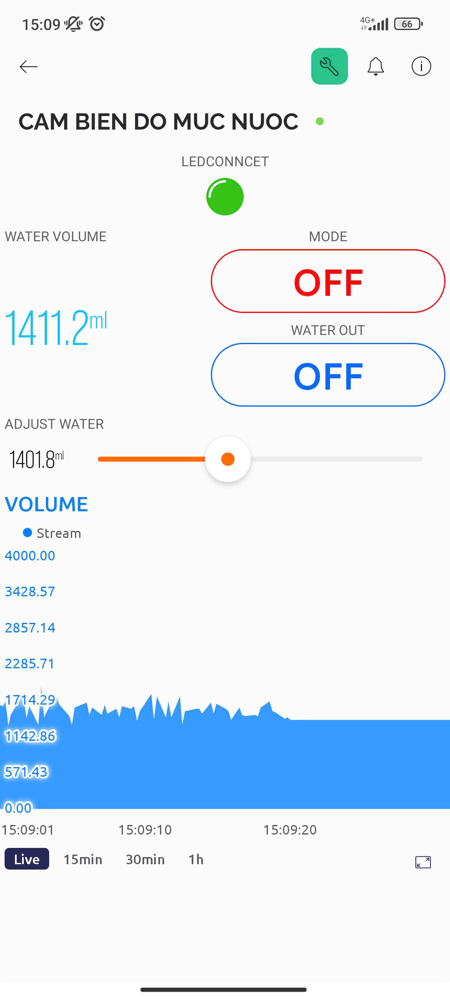

# IOT SYSTEM CONTROL STORAGE TANK

This project provide a IOT system that can monitor and control and storage tank in the industrial
- The System using a distance sensor call VL53L0X (module communicate by I2C protocol).

	

- The User interface using with IOT Blynk App.

	

	

